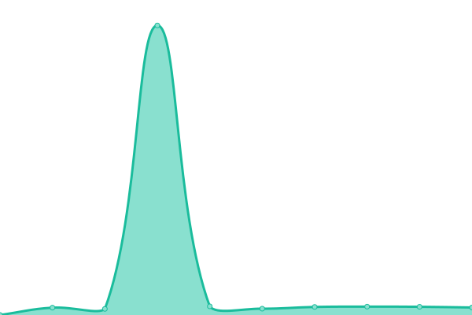
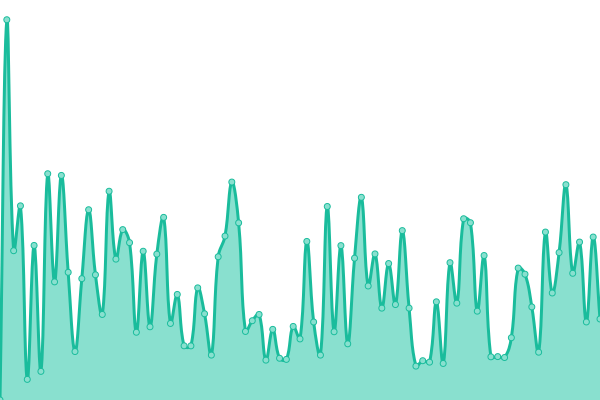
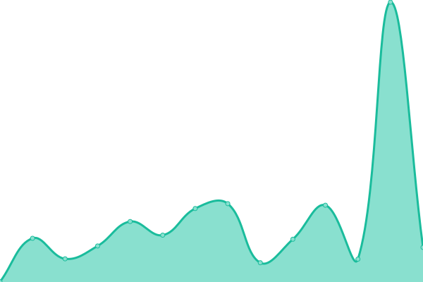

# [📈 Live Status](https://gsoftbiz.github.io/upptime): <!--live status--> **🟧 Partial outage**

This repository contains the open-source uptime monitor and status page for [gsoftbiz](https://gsoftbiz.github.io/upptime), powered by [Upptime](https://github.com/upptime/upptime).

With [Upptime](https://upptime.js.org), you can get your own unlimited and free uptime monitor and status page, powered entirely by a GitHub repository. We use [Issues](https://github.com/gsoftbiz/upptime/issues) as incident reports, [Actions](https://github.com/gsoftbiz/upptime/actions) as uptime monitors, and [Pages](https://gsoftbiz.github.io/upptime) for the status page.

<!--start: status pages-->
<!-- This summary is generated by Upptime (https://github.com/upptime/upptime) -->
<!-- Do not edit this manually, your changes will be overwritten -->
<!-- prettier-ignore -->
| URL | Status | History | Response Time | Uptime |
| --- | ------ | ------- | ------------- | ------ |
|  [beCONSENT](https://www.beconsent.tech) | 🟩 Up | [be-consent.yml](https://github.com/GSoftbiz/upptime/commits/HEAD/history/be-consent.yml) | 

 237ms
     
 | 

<a href="https://gsoftbiz.github.io/upptime/history/be-consent">100.00%</a>
    

|  [beCONSENT Admin](https://admin.beconsent.tech) | 🟩 Up | [be-consent-admin.yml](https://github.com/GSoftbiz/upptime/commits/HEAD/history/be-consent-admin.yml) | 

 233ms
     
 | 

<a href="https://gsoftbiz.github.io/upptime/history/be-consent-admin">100.00%</a>
    

|  [beSIGN](https://rst.besign.app) | 🟩 Up | [be-sign.yml](https://github.com/GSoftbiz/upptime/commits/HEAD/history/be-sign.yml) | 

 258ms
     
 | 

<a href="https://gsoftbiz.github.io/upptime/history/be-sign">100.00%</a>
    

|  [beSIGN Cert API](https://crt.besign.app/api/v1) | 🟩 Up | [be-sign-cert-api.yml](https://github.com/GSoftbiz/upptime/commits/HEAD/history/be-sign-cert-api.yml) | 

 256ms
     
 | 

<a href="https://gsoftbiz.github.io/upptime/history/be-sign-cert-api">100.00%</a>
    

|  [beSIGN Enterprise API](https://enterprise.besign.app/api/v1) | 🟩 Up | [be-sign-enterprise-api.yml](https://github.com/GSoftbiz/upptime/commits/HEAD/history/be-sign-enterprise-api.yml) | 

 253ms
     
 | 

<a href="https://gsoftbiz.github.io/upptime/history/be-sign-enterprise-api">100.00%</a>
    

|  [beSIGN Local Gateway API](https://localgw.besign.app/api/v1) | 🟩 Up | [be-sign-local-gateway-api.yml](https://github.com/GSoftbiz/upptime/commits/HEAD/history/be-sign-local-gateway-api.yml) | 

 253ms
     
 | 

<a href="https://gsoftbiz.github.io/upptime/history/be-sign-local-gateway-api">100.00%</a>
    

|  [PDF Signer](https://pdfsigner.besign.app) | 🟥 Down | [pdf-signer.yml](https://github.com/GSoftbiz/upptime/commits/HEAD/history/pdf-signer.yml) | 

 838ms
     
 | 

<a href="https://gsoftbiz.github.io/upptime/history/pdf-signer">0.00%</a>
    

|  [beSEAL](https://beseal.besign.app) | 🟩 Up | [be-seal.yml](https://github.com/GSoftbiz/upptime/commits/HEAD/history/be-seal.yml) | 

 234ms
     
 | 

<a href="https://gsoftbiz.github.io/upptime/history/be-seal">100.00%</a>
    

|  [beSEAL API](https://beseal.besign.app/api) | 🟩 Up | [be-seal-api.yml](https://github.com/GSoftbiz/upptime/commits/HEAD/history/be-seal-api.yml) | 

 227ms
     
 | 

<a href="https://gsoftbiz.github.io/upptime/history/be-seal-api">100.00%</a>
    

|  [beCOOKIES AWS](https://www.becookies.tech) | 🟥 Down | [be-cookies-aws.yml](https://github.com/GSoftbiz/upptime/commits/HEAD/history/be-cookies-aws.yml) | 

 270ms
     
 | 

<a href="https://gsoftbiz.github.io/upptime/history/be-cookies-aws">100.00%</a>
    

|  [beCOOKIES GCP](https://prod.becookies.tech) | 🟥 Down | [be-cookies-gcp.yml](https://github.com/GSoftbiz/upptime/commits/HEAD/history/be-cookies-gcp.yml) | 

 0ms
     
 | 

<a href="https://gsoftbiz.github.io/upptime/history/be-cookies-gcp">0.00%</a>
    

|  [beCOOKIES GCP API](https://prod.becookies.tech/api) | 🟥 Down | [be-cookies-gcp-api.yml](https://github.com/GSoftbiz/upptime/commits/HEAD/history/be-cookies-gcp-api.yml) | 

 0ms
     
 | 

<a href="https://gsoftbiz.github.io/upptime/history/be-cookies-gcp-api">0.00%</a>
    

|  [beDID Admin](https://admin.beid.tech) | 🟥 Down | [be-did-admin.yml](https://github.com/GSoftbiz/upptime/commits/HEAD/history/be-did-admin.yml) | 

 269ms
     
 | 

<a href="https://gsoftbiz.github.io/upptime/history/be-did-admin">100.00%</a>
    

|  [beDID Proxy API](https://proxy.beid.tech/api) | 🟥 Down | [be-did-proxy-api.yml](https://github.com/GSoftbiz/upptime/commits/HEAD/history/be-did-proxy-api.yml) | 

 1066ms
     
 | 

<a href="https://gsoftbiz.github.io/upptime/history/be-did-proxy-api">100.00%</a>
    

<!--end: status pages-->

[**Visit our status website →**](https://gsoftbiz.github.io/upptime)

## 📄 License

- Powered by: [Upptime](https://github.com/upptime/upptime)
- Code: [MIT](./LICENSE) © [gsoftbiz](https://gsoftbiz.github.io/upptime)
- Data in the `./history` directory: [Open Database License](https://opendatacommons.org/licenses/odbl/1-0/)
